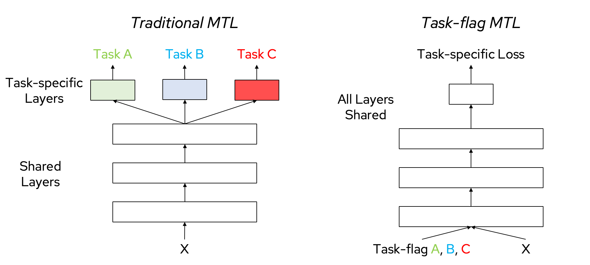

## Explicit Adaptivity: Structured Estimation of $f(c)$

In classical statistical modeling, all observations are typically assumed to share a common set of parameters. However, modern datasets often display significant heterogeneity across individuals, locations, or experimental conditions, making this assumption unrealistic in many real-world applications. To better capture such heterogeneity, recent approaches model parameters as explicit functions of observed context, formalized as $\theta_i = f(c_i)$, where $f$ maps each context to a sample-specific parameter [@doi:10.1111/j.2517-6161.1993.tb01939.x].

A familiar example of explicit adaptivity is multi-task learning, where context is defined by task identity. 
Traditional multi-task learning (left) assigns each task its own head on top of shared representations, 
while context-flagged models (right) pass task identity directly as an input, enabling richer parameter sharing. 
This illustrates how explicit conditioning on context variables can unify tasks within a single model and 
provides an intuitive entry point to more general forms of explicit adaptivity (Figure {@fig:mtl-context}).

{#fig:mtl-context width="75%"}

This section systematically reviews explicit adaptivity methods, with a focus on structured estimation of $f(c)$. We begin by revisiting classical varying-coefficient models, which provide a conceptual and methodological foundation for modeling context-dependent effects. We then categorize recent advances in explicit adaptivity according to three principal strategies for estimating $f(c)$: (1) smooth nonparametric models that generalize classical techniques, (2) structurally constrained models that incorporate domain-specific knowledge such as spatial or network structure, and (3) learned function approximators that leverage machine learning methods for high-dimensional or complex contexts. Finally, we summarize key theoretical developments and highlight promising directions for future research in this rapidly evolving field.

### Classical Varying-Coefficient Models: A Foundation

Varying-coefficient models (VCMs) are a foundational tool for modeling heterogeneity, as they allow model parameters to vary smoothly with observed context variables [@doi:10.1111/j.2517-6161.1993.tb01939.x; @doi:10.3390/publications13020019]. In their original formulation, the regression coefficients are treated as nonparametric functions of low-dimensional covariates, such as time or age. The standard VCM takes the form

$$
y_i = \sum_{j=1}^{p} \beta_j(c_i) x_{ij} + \varepsilon_i
$$

where each $\beta_j(c)$ is an unknown smooth function, typically estimated using kernel smoothing, local polynomials, or penalized splines.

This approach provides greater flexibility than fixed-coefficient models and is widely used for longitudinal and functional data analysis. The assumption of smoothness makes estimation and theoretical analysis more tractable, but also imposes limitations. Classical VCMs work best when the context is low-dimensional and continuous. They may struggle with abrupt changes, discontinuities, or high-dimensional and structured covariates. In such cases, interpretability and accuracy can be compromised, motivating the development of a variety of modern extensions, which will be discussed in the following sections.

### Advances in Modeling $f(c)$

Recent years have seen substantial progress in the modeling of $f(c)$, the function mapping context to model parameters. These advances can be grouped into three major strategies: (1) smooth non-parametric models that extend classical flexibility; (2) structurally constrained approaches that encode domain knowledge such as spatial or network topology; and (3) high-capacity machine learning methods for high-dimensional, unstructured contexts. Each strategy addresses specific challenges in modeling heterogeneity, and together they provide a comprehensive toolkit for explicit adaptivity.

#### Smooth Non-parametric Models

This family of models generalizes the classical VCM by expressing $f(c)$ as a flexible, smooth function estimated with basis expansions and regularization. Common approaches include spline-based methods, local polynomial regression, and RKHS-based frameworks. For instance, developed a semi-nonparametric VCM using RKHS techniques for imaging genetics, enabling the model to capture complex nonlinear effects. Such methods are central to generalized additive models, supporting both flexibility and interpretability. Theoretical work has shown that penalized splines and kernel methods offer strong statistical guarantees in moderate dimensions, although computational cost and overfitting can become issues as the dimension of $c$ increases. These estimators occupy the lower-capacity but more interpretable end of the explicit adaptivity spectrum, forming a conceptual baseline for more complex architectures discussed below.

#### Structured Regularization for Graphical and Network Models

The origins of structurally constrained models can be traced to early work on covariance selection. Dempster (1972) demonstrated that zeros in the inverse covariance matrix correspond directly to conditional independencies, introducing the principle that sparsity reflects structure [@doi:10.2307/2528966]. This principle was formalized in Lauritzen’s (1996) influential monograph, which systematized probabilistic graphical models and showed how independence assumptions can be embedded into estimation procedures [@doi:10.1093/oso/9780198522195.001.0001]. Together, these works established the conceptual foundation that explicit structure can guide inference in high-dimensional settings.

As high-dimensional data became common, scalable estimation procedures emerged to make these ideas practical. Meinshausen and Bühlmann (2006) proposed neighborhood selection, recasting graph recovery as a series of sparse regression problems that infer conditional dependencies node by node [@doi:10.1214/009053606000000281]. Shortly thereafter, Friedman, Hastie, and Tibshirani (2008) developed the graphical lasso, a convex penalized likelihood method that directly estimates sparse precision matrices [@doi:10.1093/biostatistics/kxm045]. These contributions showed that sparsity-inducing penalties could recover large network structures reliably, thereby providing concrete tools for estimating $f(c)$ when context corresponds to a structured dependency pattern such as a graph.

Building on these advances, later research recognized that networks themselves may vary across contexts. Guo, Levina, Michailidis, and Zhu (2011) introduced penalties that jointly estimate multiple graphical models, encouraging sparsity within each network while borrowing strength across related groups [@doi:10.1093/biomet/asq060]. Danaher, Wang, and Witten (2014) extended this framework with the Joint Graphical Lasso, which balances shared structure and context-specific edges across multiple populations [@doi:10.1111/rssb.12033]. These developments illustrate how structured regularization transforms explicit adaptivity into a principled strategy: instead of estimating networks independently, one can pool information selectively across contexts (where context $c$ is the group or task identity), making the estimation of the parameter function $f(c)$ both interpretable and statistically efficient.

**Piecewise-Constant and Partition-Based Models.**
Here, model parameters are allowed to remain constant within specific regions or clusters of the context space, rather than vary smoothly. Approaches include classical grouped estimators and modern partition models, which may learn changepoints using regularization tools like total variation penalties or the fused lasso. This framework is particularly effective for data with abrupt transitions or heterogeneous subgroups.

A key design principle is that explicit splits of the context space can emulate distinct tasks, clarifying where parameters should be shared or separated. By introducing hierarchical partitions, we can capture heterogeneity at multiple levels: sample-level variation within each context, and task-level switching across contexts. This perspective connects classical partition-based models with multi-task learning, highlighting how explicit splits of context define where parameters should be shared versus differentiated (Figure {@fig:context-splits}).

{#fig:context-splits width="75%"}

A subtle but important point is that the boundary between “parametric” and “nonparametric” adaptivity is porous. 
If we fit **simple parametric models within each context** -- for observed contexts $c$ or latent subcontexts $Z$ -- and then **aggregate across contexts**, the resulting conditional

$$
P(Y\mid X,C) \;=\; \int P(Y\mid X,C,Z)\, dP(Z\mid C)
$$

can display rich, multimodal behavior that looks nonparametric. In other words, **global flexibility can emerge from compositional, context-specific parametrics**. 
When component families are identifiable (or suitably regularized) and the context-to-mixture map is constrained (e.g., smoothness/TV/sparsity over $c$), the aggregate model remains estimable and interpretable while avoiding overflexible, ill-posed mixtures.

{#fig:compositional-inference width="85%"}

This perspective motivates flexible function approximators: trees and neural networks can be read as learning either the **context-to-mixture weights** or **local parametric maps**, providing similar global flexibility with different inductive biases.

**Structured Regularization for Spatial, Graph, and Network Data.**
When context has known spatial or network structure, regularization terms can promote similarity among neighboring coefficients or nodes. For example, spatially varying-coefficient models have been applied to problems in geographical analysis and econometrics, where local effects are expected to vary across adjacent regions [@doi:10.48550/arXiv.2410.07229; @doi:10.48550/arXiv.2502.14651]. On networked data, the network VCM of [@doi:10.1080/01621459.2025.2470481] generalizes these ideas by learning both the latent positions and the parameter functions on graphs, allowing the model to accommodate complex relational heterogeneity. Such structural constraints allow models to leverage domain knowledge, improving efficiency and interpretability where smooth models may struggle. These regularization principles can also be extended to temporal, hierarchical, or multilevel contexts, where smooth transitions or cross-level coupling may be encoded through Laplacian penalties or nested-group regularizers tailored to the structure of $c$.

Beyond spatial and single-network constraints, Bayesian approaches allow explicit modeling of multiple related graphical models across contexts. Rather than estimating each network independently or pooling across all data, these methods place structured priors that encourage information sharing when appropriate. For example, [@doi:10.1198/jasa.2011.tm10465] introduced Bayesian inference for GGMs with lattice structure, demonstrating how spatial priors can capture context-dependence across neighboring sites. Building on this idea, [@doi:10.1080/01621459.2014.896806]  proposed a Bayesian framework with a Markov random field prior and spike-and-slab formulation to learn when edges should be shared across sample groups, improving estimation and quantifying inter-context similarity. More recently, [@doi:10.1093/biomtc/ujaf053] extended these principles to covariate-dependent graph learning, where network structure varies smoothly with observed covariates. Their dual group spike-and-slab prior enables multi-level selection at node, covariate, and local levels, providing a flexible and interpretable framework for heterogeneous biological networks. Together, these advances illustrate how Bayesian structural priors make adaptivity explicit in graphical models, supporting both efficient estimation and scientific interpretability.

#### Learned Function Approximators

As context dimensionality and data complexity grow, explicit smoothness assumptions become insufficient, motivating high-capacity learners that approximate $f(c)$ directly from data. A third class of methods is rooted in modern machine learning, leveraging high-capacity models to approximate $f(c)$ directly from data. These approaches are especially valuable when the context is high-dimensional or unstructured, where classical assumptions may no longer be sufficient.

**Tree-Based Ensembles.**
Gradient boosting decision trees (GBDTs) and related ensemble methods are well suited to tabular and mixed-type data. A representative example is Tree Boosted Varying-Coefficient Models, introduced by Zhou and Hooker (2019), where GBDTs are applied to estimate context-dependent coefficient functions within a VCM framework [@doi:10.48550/arXiv.1904.01058]. This approach offers a useful balance among flexibility, predictive accuracy, and interpretability, while typically being easier to train and tune than deep neural networks. More recently, Zakrisson and Lindholm (2024) proposed a tree-based varying coefficient model that incorporates cyclic gradient boosting machines (CGBM). Their method enables dimension-wise early stopping and provides feature importance measures, thereby enhancing interpretability and offering additional regularization [@doi:10.48550/arXiv.2401.05982].

Overall, tree-based VCMs achieve strong predictive performance and retain a model structure that lends itself to interpretation, particularly when combined with tools such as SHAP for explaining model outputs.

**Bayesian Tree-Based Models.**
Recent Bayesian developments have extended tree-based varying-coefficient models toward fully probabilistic formulations. Deshpande et al. (2024) proposed VCBART, a Bayesian tree framework for varying coefficients that captures nonlinear effect modifiers while providing full posterior uncertainty quantification [@doi:10.1214/24-BA1470].

The method extends the Bayesian Additive Regression Trees (BART) family to estimate context-dependent effects within a coherent probabilistic formulation, combining the interpretability of tree partitions with the flexibility of hierarchical Bayesian inference.

By quantifying uncertainty and enabling principled regularization, VCBART bridges explicit adaptivity and probabilistic reasoning, marking a significant step toward interpretable Bayesian nonparametric modeling.

**Deep Neural Networks.**
For contexts defined by complex, high-dimensional features such as images, text, or sequential data, deep neural networks offer unique advantages for modeling $f(c)$. These architectures can learn adaptive, data-driven representations that capture intricate relationships beyond the scope of classical models. Applications include personalized medicine, natural language processing, and behavioral science, where outcomes may depend on subtle or latent features of the context.

The decision between these machine learning approaches depends on the specific characteristics of the data, the priority placed on interpretability, and computational considerations. Collectively, these advances have significantly broadened the scope of explicit adaptivity, making it feasible to model heterogeneity in ever more complex settings.

### Key Theoretical Advances

The expanding landscape of varying-coefficient models (VCMs) has been supported by substantial theoretical progress, which secures the validity of flexible modeling strategies and guides their practical use. The nature of these theoretical results often reflects the core structural assumptions of each model class.

**Theory for Smooth Non-parametric Models.**
For classical VCMs based on kernel smoothing, local polynomial estimation, or penalized splines, extensive theoretical work has characterized their convergence rates and statistical efficiency. Under standard regularity conditions, these estimators are known to achieve minimax optimality for function estimation in moderate dimensions [@@doi:10.1111/j.2517-6161.1993.tb01939.x]. More specifically, Lu, Zhang, and Zhu (2008) established both consistency and asymptotic normality for penalized spline estimators when using a sufficient number of knots and appropriate penalty terms [@doi:10.1080/03610920801931887], enabling valid inference through confidence intervals and hypothesis testing. These results provide a solid theoretical foundation even in relatively complex modeling contexts.

**Theory for Structurally Constrained Models.**
When discrete or network structure is incorporated into VCMs, theoretical analysis focuses on identifiability, regularization properties, and conditions for consistent estimation. For example, [@doi:10.1080/01621459.2025.2470481] provide non-asymptotic error bounds for estimators in network VCMs, demonstrating that consistency can be attained when the underlying graph topology satisfies certain connectivity properties. In piecewise-constant and partition-based models, results from change-point analysis and total variation regularization guarantee that abrupt parameter changes can be recovered accurately under suitable sparsity and signal strength conditions.

**Theory for High-Capacity and Learned Models.**
The incorporation of machine learning models into VCMs introduces new theoretical challenges. For high-dimensional and sparse settings, oracle inequalities and penalized likelihood theory establish conditions for consistent variable selection and accurate estimation, as seen in methods based on boosting and other regularization techniques. In the context of neural network-based VCMs, the theory is still developing, with current research focused on understanding generalization properties and identifiability in non-convex optimization. This remains an active and important frontier for both statistical and machine learning communities.

These theoretical advances provide a rigorous foundation for explicit adaptivity, a wide range of complex and structured modeling scenarios.

### Sparsity and Incomplete Measurements as Context

A central practical challenge in combining real-world datasets is inconsistent measurement: different cohorts or institutions often collect different subsets of features. One dataset may contain detailed laboratory values, another may focus on imaging or physiological measurements, and a third may emphasize clinical outcomes. If such cohorts are naively pooled, the resulting feature matrix is sparse and unbalanced. If incomplete samples are discarded, data efficiency collapses.  

Context-adaptive models provide a natural resolution by treating **measurement sparsity itself as context.** Rather than ignoring missingness, the model learns to adjust its parameterization according to which features are observed. In effect, each measurement policy (labs-only, vitals-only, multimodal) defines a context, and explicit adaptivity allows estimation that respects these differences while still sharing information. This perspective reframes missingness from a nuisance into structured signal: it encodes which sources of evidence are available and how they should be combined. This perspective reframes missingness from a nuisance into structured signal: it encodes which sources of evidence are available and how they should be combined, reflecting ideas explored in recent multimodal learning frameworks that handle missing modalities [@doi:10.48550/arXiv.2409.07825].

{#fig:sparsity-context width="70%"}

Figure @fig:sparsity-context illustrates this idea: each cohort contributes a different subset of measurements (lungs, labs, vitals), and explicit adaptivity enables integration across cohorts. By conditioning on measurement availability, we can achieve greater sample efficiency, learning from fewer individuals but with richer heterogeneous features.  

Evaluation of missingness-as-context models should report *mask-stratified metrics*, including worst-group performance, following group-robust evaluation practice [@doi:10.48550/arXiv.1911.08731; @doi:10.48550/arXiv.2012.07421]. Robustness should be probed with *mask-shift stress tests*, training under one measurement policy and testing under another, to quantify degradation and the benefit of contextualization, as formalized in the Domain Adaptation under Missingness Shift (DAMS) setting [@doi:10.48550/arXiv.2211.02093; @doi:10.48550/arXiv.2012.07421]. When imputation is used, authors should assess *imputation realism* by holding out observed entries under realistic mask distributions and reporting MAE/RMSE and calibration for $p(x_{\text{missing}}\mid x_{\text{observed}})$ [@doi:10.48550/arXiv.1806.02382; @doi:10.48550/arXiv.1806.02920]. For causal or estimation applications, conduct *ignorability sensitivity analyses*, contrasting MAR-based results with pattern-mixture or selection-model analyses under plausible MNAR mechanisms [@doi:10.2307/2337120; @10.48550/arXiv.2301.05043]. Finally, include *ablations* that remove mask/indicator inputs—and, for trees, disable default-direction routing—to confirm that gains derive from modeling the mask signal rather than artifacts [@doi:10.48550/arXiv.1603.02754; @doi:10.48550/arXiv.2211.09259]. Practical implementations of these ideas are widely available: **GRU-D** [@doi:10.48550/arXiv.1606.01865] and **BRITS** [@doi:10.48550/arXiv.1805.10572] provide mask- and time-aware sequence models, while **GAIN** [@doi:10.48550/arXiv.1806.02920] and **VAEAC** [@doi:10.48550/arXiv.1806.02382] offer open-source code for imputation under arbitrary masks. For tree ensembles, **XGBoost** supports sparsity-aware default-direction splits, making it straightforward to treat “NA” values as context without preprocessing [@doi:10.1145/2939672.2939785].

### Context-Aware Efficiency Principles and Design

The efficiency of context-adaptive methods hinges on several key design principles that balance computational tractability with statistical accuracy. These principles guide the development of methods that can scale to large datasets while maintaining interpretability and robustness.

One central principle is the use of sparsity assumptions to limit the number of context-dependent parameters. This can be achieved through group sparsity, which encourages entire groups of parameters to be zero simultaneously [@doi:10.1111/j.1467-9868.2005.00532.x], hierarchical regularization that applies different strengths of shrinkage to varying levels of context specificity [@doi:10.1017/CBO9780511790942], and adaptive thresholding that dynamically adjusts sparsity levels in accordance with context complexity.

Efficiency can also be enhanced through computational strategies that allocate resources adaptively. Early stopping terminates optimization for contexts where convergence occurs rapidly [@doi:10.48550/arXiv.1606.04838], while context-dependent sampling employs different sampling schemes across contexts [@doi:10.48550/arXiv.1809.09582]. Caching and warm-starting further accelerate optimization by leveraging solutions from similar contexts, particularly effective when contexts exhibit smooth variation [@doi:10.1561/2200000016].

A further consideration is the balance between efficiency and interpretability. Linear context functions are highly interpretable but may require many parameters, while explicit context encodings improve transparency at the potential cost of higher computational overhead. Local context modeling provides fine-grained interpretability but may be less scalable to large applications. These trade-offs should be evaluated in light of application-specific requirements. For example, advanced adaptive optimizers like Adam can efficiently train complex, nonlinear models, but the resulting systems may be less interpretable than simpler alternatives [@doi:10.48550/arXiv.1412.6980]. In practice, such context-dependent computation appears in adaptive batching, per-context learning rates, and multi-fidelity optimization pipelines that dynamically adjust compute and precision depending on context complexity.

### Synthesis and Future Directions

Selecting an appropriate modeling strategy for $f(c)$ involves weighing flexibility, interpretability, computational cost, and the extent of available domain knowledge. Learned function approximators, such as deep neural networks, offer unmatched capacity for modeling complex, high-dimensional relationships. However, classical smooth models and structurally constrained approaches often provide greater interpretability, transparency, and statistical efficiency. The choice of prior assumptions and the scalability of the estimation procedure are also central considerations in applied contexts.

Looking forward, several trends are shaping the field. One important direction is the integration of varying-coefficient models with foundation models from natural language processing and computer vision. By using pre-trained embeddings as context variables $c_i$, it becomes possible to incorporate large amounts of prior knowledge and extend VCMs to multi-modal and unstructured data sources. Another active area concerns the principled combination of cross-modal contexts, bringing together information from text, images, and structured covariates within a unified VCM framework.

Advances in interpretability and visualization for high-dimensional or black-box coefficient functions are equally important. Developing tools that allow users to understand and trust model outputs is critical for the adoption of VCMs in sensitive areas such as healthcare and policy analysis.

Finally, closing the gap between methodological innovation and practical deployment remains a priority. Although the literature has produced many powerful variants of VCMs, practical adoption is often limited by the availability of software and the clarity of methodological guidance [@doi:10.3390/publications13020019]. Continued investment in user-friendly implementations, open-source libraries, and empirical benchmarks will facilitate broader adoption and greater impact.

In summary, explicit adaptivity through structured estimation of $f(c)$ now forms a core paradigm at the interface of statistical modeling and machine learning. Future progress will focus not only on expanding the expressive power of these models, but also on making them more accessible, interpretable, and practically useful in real-world applications.
