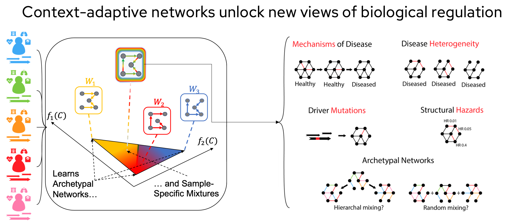

## Applications, Case Studies, Evaluation Metrics, and Tools

This section surveys how context-adaptive methods manifest across domains, how their performance is assessed, and what tools enable them in practice.

### Implementation Across Sectors

Many real-world environments are dynamic and unpredictable, meaning that models built on static assumptions often fail when conditions shift. To remain reliable, models must be able to adapt to changing inputs, contexts, and behaviors. This adaptability is especially important in high-stakes domains where decisions directly affect human well-being or carry significant financial consequences. Two prominent examples are healthcare and finance. In healthcare, context-adaptive models enable more personalized treatment decisions and support early intervention by capturing the evolving state of patients and diseases. In finance, these models capture rapidly changing market conditions, allowing forecasts and risk assessments to remain accurate in volatile times.

Healthcare is one of the domains that benefits greatly from context-aware models because clinical and biomedical data are often hierarchical, exhibiting nested structures and evolving over time. For example, patients may have repeated measurements (e.g., vitals, labs) nested within visits, and these visits are themselves nested within broader care episodes. At the same time, disease trajectories and treatment responses are highly dynamic, requiring models that can adapt to changing contexts rather than assuming static relationships. Several reviews highlight the importance of methods that explicitly account for such complexity in longitudinal and multilevel health data [@doi:10.1002/9780470973394; @doi:10.1177/0962280217706728]. One concrete example is a Bayesian multilevel time-varying joint model that captures complex structures while estimating diverse time-varying relationships, including both response–predictor and response–response dependencies [@doi:10.1002/sim.9582]. Such models often employ hierarchical priors to borrow strength across patients while maintaining individualized inference. In this framework, time-varying coefficients are flexibly estimated using Bayesian P-splines, and inference is performed through Markov Chain Monte Carlo (MCMC). The result is a computationally efficient algorithm that provides interpretable modeling of patient outcomes as they evolve over time.

In finance, context-aware models are particularly valuable for capturing the complex dynamics that unfold both over time and across countries, sectors, and assets, which together drive macroeconomic and market behavior. For instance, cross-sectional dependencies, which capture interconnectedness at the same point in time, emerge when shocks propagate differently across regions or industries, while temporal dependencies, which capture persistence across time, arise from persistent volatility clustering and regime changes. Several reviews and comparative studies emphasize the need for methods that can adapt to such heterogeneity in modern financial data [@doi:10.1016/j.chaos.2008.07.022; @doi:10.48550/arXiv.2212.03471]. A prominent line of work develops Bayesian matrix dynamic factor models (MDFMs), which provide a powerful framework for analyzing matrix-valued time series increasingly common in macro-finance applications [@doi:10.48550/arXiv.2409.08354]. These models incorporate multiple context-adaptive features. On the temporal side, an autoregressive factor process captures persistent comovement and improves recursive forecasting, while stochastic volatility, fat-tailed error distributions, and explicit COVID-19 outlier adjustments allow the model to remain robust under real-world market shocks. The approximate factorization reduces complexity from cubic to linear in the number of assets, making large-scale forecasting feasible.

### Context-Aware Efficiency in Practice

The principles of context-aware efficiency find practical applications across diverse domains, demonstrating how computational and statistical efficiency can be achieved through intelligent context utilization.

In healthcare applications, context-aware efficiency enables adaptive imaging protocols that adjust scan parameters based on patient context such as age, symptoms, and medical history, reducing unnecessary radiation exposure. Personalized screening schedules optimize screening frequency based on individual risk factors and previous results, while resource allocation systems efficiently distribute limited healthcare resources based on patient acuity and context.

Financial services leverage context-aware efficiency principles in risk assessment by adapting risk models based on market conditions, economic indicators, and individual borrower characteristics. Fraud detection systems use context-dependent thresholds and sampling strategies to balance detection accuracy with computational cost, while portfolio optimization dynamically adjusts rebalancing frequency based on market volatility and transaction costs [@doi:0.1093/rfs/15.4.1137].

Industrial applications benefit from context-aware efficiency through predictive maintenance systems that adapt maintenance schedules based on equipment context including age, usage patterns, and environmental conditions [@doi:10.1109/TR.2016.2570568]. Quality control implements context-dependent sampling strategies that focus computational resources on high-risk production batches, and inventory management uses context-aware forecasting to optimize stock levels across different product categories and market conditions.

A notable example of context-aware efficiency is adaptive clinical trial design, where trial parameters are dynamically adjusted based on accumulating evidence while maintaining statistical validity. Population enrichment refines patient selection criteria based on early trial results, and dose finding optimizes treatment dosages based on individual patient responses and safety profiles. These applications demonstrate how context-aware efficiency principles can lead to substantial improvements in both computational performance and real-world outcomes.

### Formal Metrics for Evaluating Context-Aware Performance

Building on the theoretical framework introduced in earlier sections, we now formalize the evaluation criteria used to quantify context-adaptive behavior.  
These metrics capture predictive accuracy, adaptation efficiency, transferability, and robustness under contextual variation.

Let $\mathcal{C}$ denote the context space and $\mathcal{D}_{\mathrm{test}}$ a test distribution over $(x, y, c)$.  
For a predictor $\hat{f}$, define the context-conditional risk as

$$
\mathcal{R}(\hat{f}\mid c)
= \mathbb{E}\!\left[\, \ell\big(\hat{f}(x,c), y\big) \,\middle|\, c \,\right],
\qquad
\mathcal{R}(\hat{f})
= \mathbb{E}_{c\sim \mathcal{D}_{\mathrm{test}}}\!\left[\, \mathcal{R}(\hat{f}\mid c) \,\right].
$$

A context-stratified evaluation reports $\mathcal{R}(\hat{f}\mid c)$ across predefined bins or via a smoothed estimate  
$\int \mathcal{R}(\hat{f}\mid c)\,\mathrm{d}\Pi(c)$ for a reference measure $\Pi$ that weights regions of the context space.

#### Adaptation Efficiency

To evaluate how rapidly a model benefits from in-context examples,  
let $S_k(c)=\{(x_j, y_j, c)\}_{j=1}^k$ denote $k$ examples available within context $c$.  
Define the adaptation efficiency as

$$
\mathrm{AE}_k(c)
= \mathcal{R}(\hat{f}_0 \mid c)
\- \mathcal{R}(\hat{f}_{S_k} \mid c),
\qquad
\mathrm{AE}_k
= \mathbb{E}_{c}\!\left[\, \mathrm{AE}_k(c) \,\right],
$$

where $\hat{f}\_0$ is the non-adapted baseline and $\hat{f}\_{S_k}$ the adapted predictor.  
The function $k \mapsto \mathrm{AE}_k$ summarizes few-shot adaptation gains across different context sizes.

#### Transfer Performance

Transfer across source and target contexts, $\mathcal{C}\_{\mathrm{src}} \to \mathcal{C}_{\mathrm{tgt}}$,  
with shared representation $\phi$, can be measured by

$$
\mathrm{TP}(\phi)
= \mathcal{R}_{\mathcal{C}_{\mathrm{tgt}}}\!\big(\hat{f}_{\phi}\big)
\- \mathcal{R}_{\mathcal{C}_{\mathrm{tgt}}}\!\big(\hat{f}_{\mathrm{scratch}}\big),
$$

quantifying performance retained when transferring $\phi$ from source to target contexts compared with training from scratch.

#### Robustness to Context Shift

To assess stability under distributional perturbations,  
let $Q$ denote a family of admissible context shifts (e.g., $f$-divergence or Wasserstein balls over context marginals).  
Then the robustness score is defined as

$$
\mathrm{RS}(\hat{f}; Q)
= \sup_{\widetilde{\mathcal{D}}\in Q}
\left[
\mathcal{R}_\{\widetilde{\mathcal{D}}}(\hat{f})
\- \mathcal{R}_{\mathcal{D}_{\mathrm{test}}}(\hat{f})
\right],
$$

where higher values indicate greater sensitivity to contextual changes.

These metrics provide a unified quantitative view of context-aware performance.  
They complement the theoretical efficiency results developed in Section 4  
and serve as practical diagnostics for evaluating real-world adaptivity across diverse applications.

### Context-Aware Efficiency in Practice

The principles of context-aware efficiency find practical applications across diverse domains, demonstrating how computational and statistical efficiency can be achieved through intelligent context utilization.

In healthcare applications, context-aware efficiency enables adaptive imaging protocols that adjust scan parameters based on patient context such as age, symptoms, and medical history, reducing unnecessary radiation exposure. Personalized screening schedules optimize screening frequency based on individual risk factors and previous results, while resource allocation systems efficiently distribute limited healthcare resources based on patient acuity and context.

Financial services leverage context-aware efficiency principles in risk assessment by adapting risk models based on market conditions, economic indicators, and individual borrower characteristics. Fraud detection systems use context-dependent thresholds and sampling strategies to balance detection accuracy with computational cost, while portfolio optimization dynamically adjusts rebalancing frequency based on market volatility and transaction costs [@doi:10.1109/TR.2016.2570568].

Industrial applications benefit from context-aware efficiency through predictive maintenance systems that adapt maintenance schedules based on equipment context including age, usage patterns, and environmental conditions [@doi:0.1093/rfs/15.4.1137]. Quality control implements context-dependent sampling strategies that focus computational resources on high-risk production batches, and inventory management uses context-aware forecasting to optimize stock levels across different product categories and market conditions.

A notable example of context-aware efficiency is adaptive clinical trial design, where trial parameters are dynamically adjusted based on accumulating evidence while maintaining statistical validity. Population enrichment refines patient selection criteria based on early trial results, and dose finding optimizes treatment dosages based on individual patient responses and safety profiles. These applications demonstrate how context-aware efficiency principles can lead to substantial improvements in both computational performance and real-world outcomes.

### Contextualized Network Inference

One domain where context-adaptive models have shown particular promise is in network inference for genomics. Traditional approaches assume that all samples can be pooled into a single network, or that cohorts can be partitioned into homogeneous groups. These assumptions are often unrealistic: cancer, for example, exhibits both cross-patient heterogeneity and within-patient shifts in gene regulation. 

Contextualized network models address this challenge by learning archetypal networks and then representing each sample as a mixture of these archetypes, weighted by its observed context. This formulation allows researchers to move beyond average-case networks and uncover mechanisms of disease, heterogeneity across patients, driver mutations, and structural hazards.

Such contextualized networks have been applied in TCGA cancer genomics to identify patient-specific driver modules.

{#fig:contextualized-networks width="90%"}

### Performance Evaluation

Evaluating context-adaptive models requires careful consideration of predictive accuracy, robustness to variability, and scalability, with the emphasis varying by domain. Key aspects of performance evaluation include the choice of metrics, the handling of uncertainty, and assessment under stress or rare-event conditions.

In healthcare, evaluation prioritizes patient-specific predictive accuracy and calibrated uncertainty. Common metrics include mean squared error (MSE), concordance indices (C-index), and calibration curves, which measure how well models capture longitudinal patient trajectories and provide reliable uncertainty estimates. Multi-target Bayesian approaches and survival models demonstrate the importance of capturing correlations across outcomes and assessing credible interval coverage to quantify predictive confidence [@arXiv:2509.08183; @arXiv:2509.01794]. Evaluations in this domain also highlight trade-offs between model complexity, interpretability, and computational feasibility, since high-fidelity patient-level predictions can be costly to compute.

In finance and macro forecasting, performance evaluation emphasizes predictive accuracy under volatile conditions and resilience to structural breaks. Metrics such as root mean squared forecast error (RMSFE), log-likelihood, and stress-test performance are commonly used to assess how well models handle crises or abrupt shifts in data [@arXiv:2409.08354; @arXiv:2508.10055]. Probabilistic metrics, including posterior predictive checks and uncertainty bounds, provide additional insight into the reliability of forecasts, while chaos-informed diagnostics can highlight vulnerabilities to extreme events [@arXiv:2406.12274].

Across domains, consistent patterns emerge. Context-adaptive models outperform static baselines when variability is structured and partially predictable, but performance can degrade in data-sparse regimes or under unmodeled abrupt changes [@arXiv:2303.02781v1]. Evaluations therefore combine error-based measures, probabilistic calibration, and robustness tests to give a holistic view of model performance. The focus should be on these evaluation criteria, rather than the models themselves, to understand where and why context-adaptive approaches provide real advantages. Hence, evaluation protocols must jointly assess accuracy, calibration, and transferability under context perturbations.

### Survey of Tools

There are many technological supports that have emerged to support context-adaptive modeling. These tools provide the infrastructure, memory, and efficiency mechanisms that allow models to operate effectively in dynamic environments.

Retrieval-augmented generation (RAG) has become a core support for adaptivity, enabling models to incorporate new knowledge at inference time instead of relying only on static parameters. Recent surveys outline how RAG architectures combine dense retrievers, re-rankers, and generators into pipelines that continuously update with external information. This allows models to remain aligned with changing knowledge bases [@arXiv:2410.12837]. Beyond improving factuality, RAG also underpins adaptive behavior in AI-generated content, where external retrieval reduces hallucination and provides domain-specific grounding [@arXiv:2402.19473]. These systems depend on efficient vector search. Tools such as FAISS use approximate nearest neighbor algorithms to index billions of embeddings with low latency, while Milvus integrates distributed storage to scale such systems across production environments [@arXiv:1702.08734]. Together, retrieval pipelines and vector databases constitute the infrastructure through which context-adaptive models dynamically expand their accessible knowledge.

While retrieval addresses external knowledge, memory systems support continuity within ongoing interactions. Research on AI memory frameworks emphasizes how models require mechanisms to persist relevant context, get rid of redundancy, and resurface information at appropriate times [@arXiv:2504.15965]. Recent implementations such as MemoryOS illustrate how adaptive memory systems can summarize past conversations, cluster related items, and strategically reinsert them into prompts, producing long-term coherence that can’t be achieved with static context windows alone [@arXiv:2506.06326]. These memory architectures extend adaptivity from the level of just accessing facts to maintaining evolving histories, allowing models to not just adjust to new data, but also to be more consistent and contextually aware of their interactions.

Another critical support lies in scaling sequence length. Standard transformers suffer quadratic complexity and degraded performance as contexts grow, making it difficult to adapt to long or streaming data. New serving infrastructures such as StreamingLLM introduce rolling caches that let models handle long inputs without full recomputation, while frameworks like vLLM use paged attention to manage GPU memory efficiently during extended inference [@arXiv:2309.17453; @arXiv:2309.06180]. This long-context support shifts adaptability from handling snapshots of information to maintaining awareness across evolving information streams.

### Selection and Usage Guidance

Deploying context-adaptive models effectively requires careful alignment between model capabilities, domain needs, and practical constraints.

In healthcare, where data is often hierarchical and time-varying, Bayesian multilevel models and generalized varying-coefficient frameworks are well suited because they can flexibly capture nonlinear interactions and evolving patient trajectories. In finance, high-dimensional time series demand scalability, making matrix dynamic factor models more appropriate than fully specified multivariate systems.

Domain priorities should drive tool choice. Clinical applications often require interpretable models that clinicians can trust, favoring spline-based or single-index approaches even if they sacrifice some predictive accuracy. In contrast, finance applications typically prioritize forecasting performance under volatility, where more complex factor models can offer a competitive edge despite reduced transparency.

Many context-adaptive models rely on resource-intensive inference methods such as MCMC, which may limit scalability. Approximate inference techniques like variational Bayes or stochastic optimization can mitigate this burden for large datasets. In real-time decision settings, long-context processing methods such as StreamingLLM or KV-cache compression provide efficiency gains but require specialized engineering and hardware support.

Finally, tool selection should reflect whether the primary objective is scientific insight or operational decision-making. Biomedical research benefits most from flexible, interpretable models that generate new hypotheses, whereas domains like trading demand models capable of rapid adaptation, scalable inference, and strong predictive accuracy under uncertainty.

There is no one-size-fits-all context-adaptive model. Successful deployment depends not only on technical choices but also on aligning model adaptivity with domain-specific interpretability and governance requirements.
